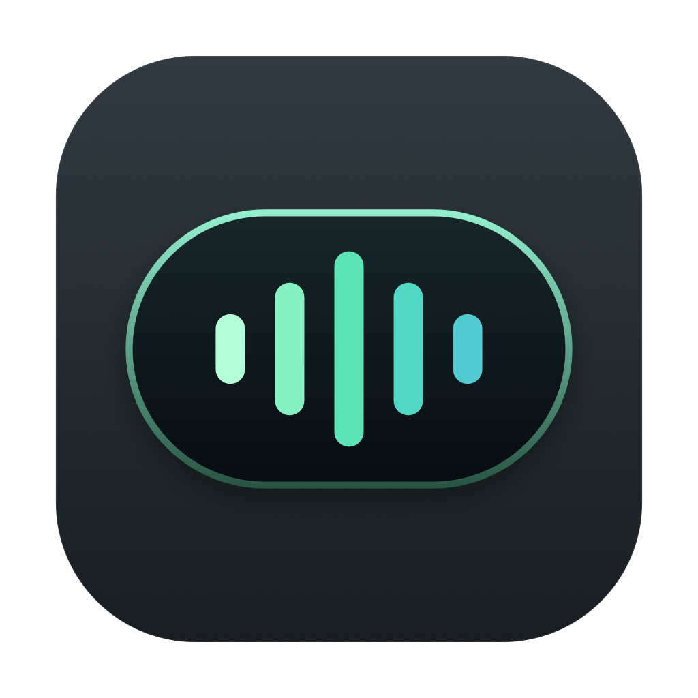
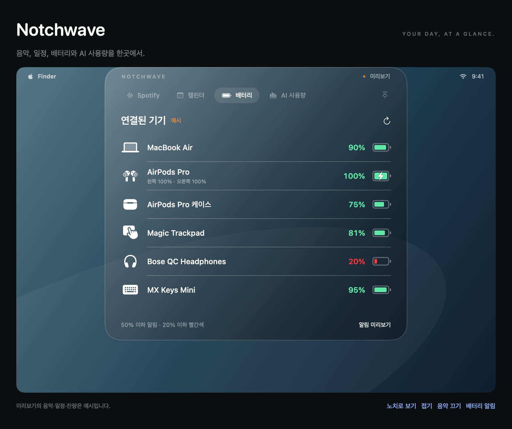
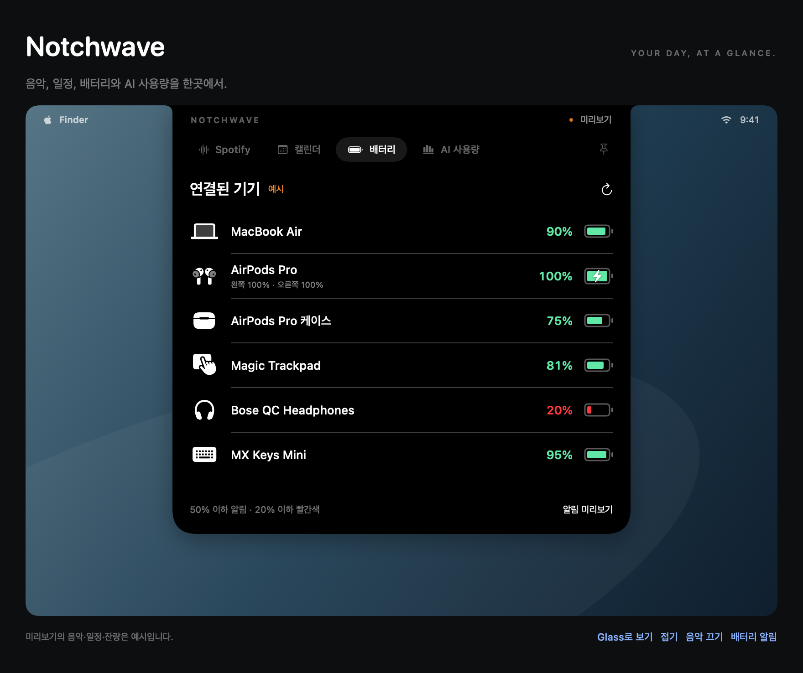
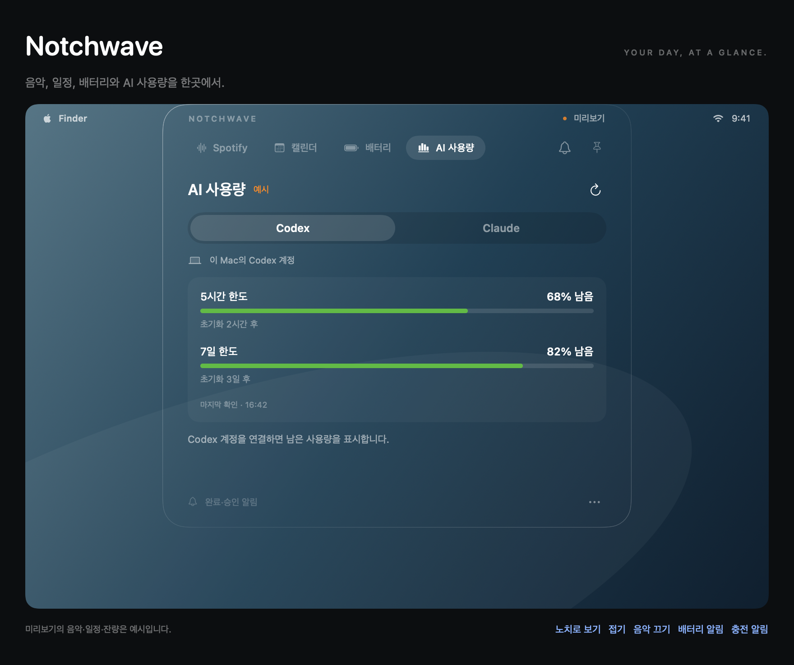
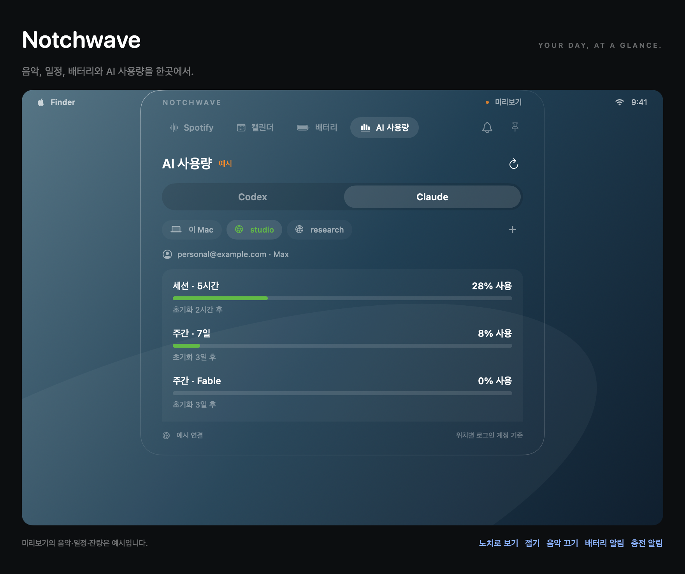

# Notchwave



**음악, 일정, 배터리와 AI 작업 상태를 Mac의 화면 상단에서.**

Notchwave는 MacBook의 노치를 작은 대시보드로 활용하는 macOS 앱입니다. 외장 모니터나 Mac mini처럼 노치가 없는 환경에서는 메뉴 막대 중앙의 반투명 캡슐로 표시됩니다. 마우스를 올리거나 클릭하면 필요한 정보와 컨트롤이 펼쳐집니다.

SwiftUI · AppKit · Apple Silicon · macOS 13+



> 이미지는 예시 데이터로 만든 디자인 미리보기입니다. 실제 기기·계정 정보가 아닙니다. Glass 이미지는 배경을 합성한 정적 표현이며, 실행 중인 앱은 실제 바탕화면과 창을 반영합니다. 위 배터리 이미지는 초기 디자인으로, 현재 버전에는 알림 보관함 버튼 등이 추가되었습니다.

## 주요 기능

| 기능 | 할 수 있는 일 |
| --- | --- |
| Spotify | 현재 곡과 앨범 아트 확인, 이전·다음 곡, 재생·일시정지, 재생 위치 조절 |
| 캘린더 | 주간 요약·시간표, 날짜별 일정 목록, 일정 생성·수정 |
| 배터리 | Mac과 연결 액세서리 잔량, 충전 상태, 배터리 부족·충전 시작 알림 |
| AI 사용량 | Codex와 Claude를 개별 연결하고 사용 한도·초기화 시간 확인 |
| AI 알림 | 응답 완료·승인 요청 알림, 알림 보관함, 해당 대화·원격 작업 열기 |
| SSH 연결 | Mac의 SSH 설정에서 Claude 서버 선택, 서버별 로그인 계정·사용량 표시 |

## 화면에 맞는 두 가지 디자인

### 외장 모니터 · 노치 없는 Mac

시스템에 지정한 **메인 디스플레이**의 메뉴 막대 중앙에 Glass 캡슐을 배치합니다. macOS 26 이상에서는 Liquid Glass를 함께 적용하고, 이전 버전에서는 반투명 소재를 사용합니다.

- 아무 활동이 없을 때는 작은 캡슐로 유지합니다.
- 음악이 재생되면 앨범 아트와 재생 표시가 나타납니다.
- 배터리·충전 알림은 잠시 표시된 뒤 사라집니다.
- 마우스를 올리거나 클릭하면 같은 위치에서 패널이 아래로 펼쳐집니다.

### 노치가 있는 MacBook

노치와 이어지는 검은 패널로 펼쳐져 화면 상단에 자연스럽게 연결됩니다. 기본 기능은 Glass 모드와 같습니다. 외장 모니터가 메인 화면이라면 노치가 있는 내장 화면 대신 외장 화면을 사용합니다.

접힌 상태의 음악 표시는 카메라 양옆에 작은 커버와 파형만 표시합니다. AI·배터리 알림은 약 300pt 폭으로 표시하며, 대화 제목과 기기 이름을 카메라 바로 아래에 배치해 노치에 가리지 않게 합니다.



*초기 노치 디자인 미리보기. 위 Glass 디자인과 같은 예시 기기를 표시합니다.*

패널의 **핀**을 누르면 마우스를 옮겨도 열린 상태를 유지합니다. 바깥을 클릭하면 닫히며, 일정 편집 중에는 작성 중인 화면을 유지합니다.

## 음악 · 일정 · 기기 배터리

**Spotify**는 Mac용 Spotify 앱과 연결합니다. 현재 곡을 확인하거나 재생을 제어할 수 있으며, 접힌 상태의 앨범 표시는 실제로 음악을 재생할 때만 나타납니다.

**캘린더**는 macOS에 동기화된 캘린더를 읽습니다. 주간 요약으로 일정을 훑어보고 하루 전체 목록이나 시간표로 전환할 수 있습니다. 앱 안에서 일정을 만들거나 수정하며, 저장을 눌렀을 때 캘린더에 반영합니다.

**배터리**는 MacBook, AirPods와 케이스, 키보드, 트랙패드, 헤드폰 등 시스템이 잔량을 제공하는 기기를 모아 보여 줍니다. 목록의 잔량은 21% 이상 초록색, 20% 이하 빨간색이며, 충전 중이 아닌 기기가 50% 이하가 되면 알립니다. 충전이 시작되면 원형 잔량 게이지와 충전 알림이 나타납니다.

## Codex · Claude 사용량

AI 사용량 안에 **Codex / Claude** 탭이 있습니다. 처음에는 각 서비스의 연결 화면을 표시하고, 연결한 후 한도와 초기화 시각을 보여 줍니다.

### Codex

이 Mac에 로그인한 Codex 계정의 **남은 비율**과 초기화 시간을 표시합니다. 완료·승인 알림도 이 탭에서 관리합니다.



### Claude · 로컬과 SSH

**Claude 연결 → 로컬 / 원격**을 선택합니다. 원격은 `~/.ssh/config`에서 읽은 서버를 체크해 추가합니다. 연결 과정은 기존 패널 안에서 진행됩니다.

연결 후에는 **이 Mac / 서버명** 하위 탭이 생깁니다. 각 위치의 계정 이메일·요금제 아래에 **사용한 비율**과 초기화 시간을 표시하므로, 서버마다 서로 다른 계정을 쓰는 경우에도 구분할 수 있습니다. 5시간·전체 주간·모델별 주간 한도는 해당 계정이 실제 제공하는 항목만 표시합니다.



*사용량 이미지는 현재 탭 구조로 렌더링했습니다. 서버명, 이메일, 요금제와 수치는 모두 예시입니다.*

원격 사용량 조회와 알림 연결은 평소 `claude` 명령을 실행하는 로그인 환경의 설정을 따릅니다. 알림 훅이 누락되면 **알림 설정 확인 필요**와 **알림 다시 연결** 버튼을 표시합니다. 인증 정보는 서버 안에서만 사용하며, 토큰이나 대화 내용을 Mac으로 가져오지 않습니다.

## AI 작업 알림

다른 앱을 보고 있을 때도 Codex와 Claude Code의 응답 완료·승인 요청을 노치 또는 캡슐에서 확인할 수 있습니다.

- Codex 알림에는 대화 제목이 나타나며, 누르면 해당 대화를 엽니다.
- 읽지 않은 알림이 보관함에 남아 있으면 핀 옆의 종 아이콘에 배지가 표시됩니다.
- 접힌 캡슐에도 보관된 완료·승인 알림의 총개수가 남습니다. 음악 재생 중에도 파형 옆에 표시되며, 알림을 확인하거나 지우면 개수가 갱신됩니다.
- Codex에서 대화를 읽으면 완료 알림도 자동으로 정리합니다. 승인 요청은 작업 재개·종료 등 실제 상태에 따라 정리합니다.
- 원격 Claude는 Ghostty에서 SSH·tmux로 실행한 작업도 지원합니다. 알림을 누르면 해당 원격 tmux 작업을 새 탭에서 엽니다.

Codex CLI의 승인 알림에는 최초 훅 신뢰 설정이 필요합니다. 원격 Claude 연결 조건과 알림의 세부 동작은 [사용 및 연결 가이드](docs/guide.md)를 참고하세요.

## 빌드와 실행

현재 빌드 스크립트는 **Apple Silicon Mac**을 대상으로 합니다. macOS 26 SDK가 포함된 Xcode Command Line Tools가 필요하며, 앱의 최소 실행 대상은 macOS 13입니다. 완전한 Liquid Glass 효과는 macOS 26 이상에서 사용할 수 있습니다.

```sh
git clone git@github.com:youngchan2/Notch.git
cd Notch
bash build.sh
open build/Notchwave.app
```

앱은 Dock 아이콘 없이 메뉴 막대의 파형 아이콘으로 동작합니다. 앱 안에서 사용할 기능을 연결하세요.

일상적으로 사용할 앱은 `~/Applications/Notchwave.app` 한 곳에 두는 것을 권장합니다. 앱을 종료한 뒤 아래처럼 같은 경로에 빌드하면 업데이트마다 별도 사본을 만들지 않습니다.

```sh
bash build.sh "$HOME/Applications/Notchwave.app"
open "$HOME/Applications/Notchwave.app"
```

빌드 캐시와 아이콘의 중간 파일은 소스 폴더의 `.build/`에 모이며 Git에는 포함하지 않습니다. 기존 AI 알림을 연결한 뒤 앱 위치를 바꾼 경우에는 새 위치의 앱에서 알림 연결을 다시 설정해야 합니다.

**로그인 시 자동 실행:** macOS의 **시스템 설정 → 일반 → 로그인 항목 및 확장 프로그램**에서 로그인 시 열기 목록에 `~/Applications/Notchwave.app`을 추가하세요. 이 설정은 재시동 후 사용자 계정에 로그인할 때 앱을 시작합니다. [Apple 안내](https://support.apple.com/ko-kr/guide/mac-help/mh15189/mac)

| 연결 대상 | 준비 사항 |
| --- | --- |
| Spotify | Mac용 Spotify 설치, macOS 자동화 권한 허용 |
| 캘린더 | macOS 캘린더 전체 접근 허용 |
| Codex | Codex CLI 설치 및 ChatGPT 계정 로그인 |
| 로컬 Claude | Claude Code 로그인, 상태 표시줄 사용량 데이터를 지원하는 버전 |
| 원격 Claude | SSH 키 인증과 확인된 호스트 키, 서버의 Python 3.8+ 및 Claude Code 로그인 |
| 원격 작업 열기 | Ghostty 1.3+, tmux, macOS 자동화 권한 |

기본 SDK로 빌드되지 않는 경우 설치된 SDK 경로를 지정할 수 있습니다.

```sh
NOTCHWAVE_SDK_PATH=/Library/Developer/CommandLineTools/SDKs/MacOSX26.5.sdk bash build.sh
```

## 미리보기와 개발

메뉴 막대의 **미리보기 창 열기**에서 예시 데이터로 디자인과 상호작용을 확인할 수 있습니다. 미리보기는 실제 캘린더나 계정을 변경하지 않습니다.

```sh
# 동작 검사
build/Notchwave.app/Contents/MacOS/Notchwave --self-test
python3 -B -m unittest discover -s Tests -v

# 화면 배치 진단
build/Notchwave.app/Contents/MacOS/Notchwave --diagnostics

# 예시 화면을 PNG로 저장: 로그인된 macOS 그래픽 세션에서 실행
build/Notchwave.app/Contents/MacOS/Notchwave --render /tmp/notchwave-glass.png --glass
build/Notchwave.app/Contents/MacOS/Notchwave --render /tmp/notchwave-claude.png --glass --usage -usageSelectedProvider Claude
```

| 경로 | 내용 |
| --- | --- |
| `Sources/Notchwave/` | SwiftUI 화면, 패널 배치, 서비스 연결과 자체 검사 |
| `Resources/` | 원격 Claude 알림 전달기와 사용량 조회 도구 |
| `scripts/make-icon.swift` | macOS 앱 아이콘을 크기별로 그리는 벡터 원본 |
| `Tests/` | Python 도구 검사 |
| `docs/images/` | README 디자인 미리보기 |
| [docs/guide.md](docs/guide.md) | 기능별 사용법, 연결·알림 동작, 호환성 설명 |

## 지원 범위

Spotify는 Mac용 앱을 지원합니다. 유튜브 뮤직·멜론·영상 PIP는 현재 구현 범위에 포함되지 않습니다. 액세서리 배터리는 macOS가 잔량을 제공하는 기기에 한해 표시됩니다.

원격 Claude 사용량과 일부 Codex 알림·읽음 감지는 서비스 내부 형식에 의존하므로 업데이트 후 호환성 보완이 필요할 수 있습니다. 자세한 경로와 제한은 [연결 가이드](docs/guide.md)에 정리했습니다.

현재는 로컬 개발용 서명을 사용하는 앱입니다. 일반 배포에는 개발자 서명·공증과 액세서리 API 호환성 검토가 필요합니다.
